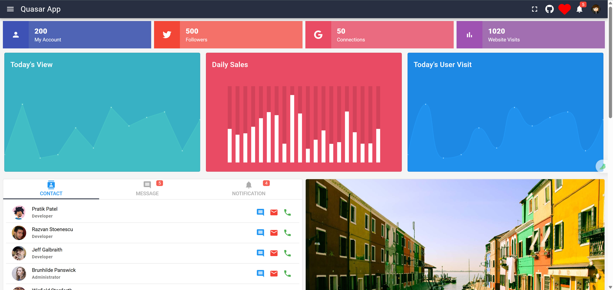
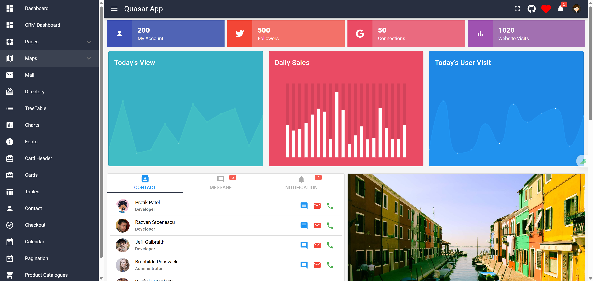
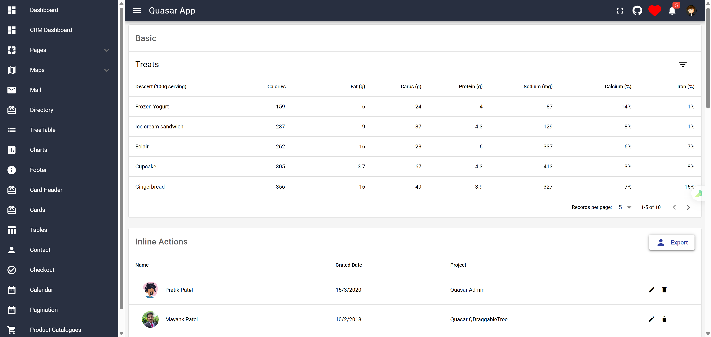
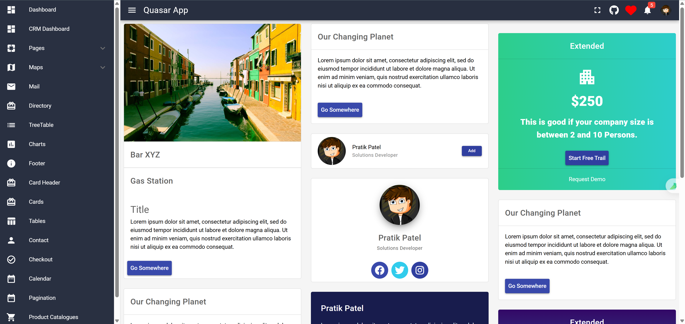
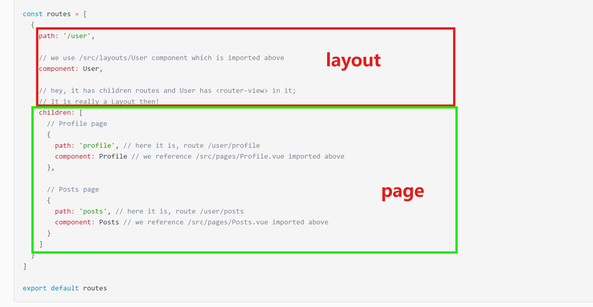
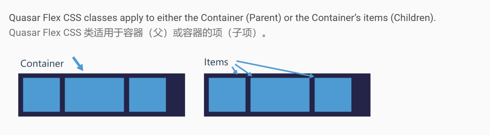
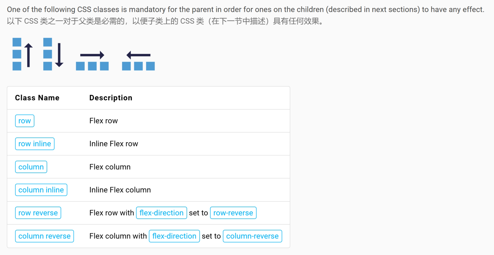
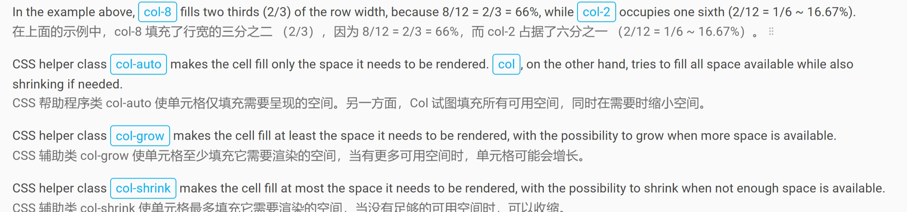
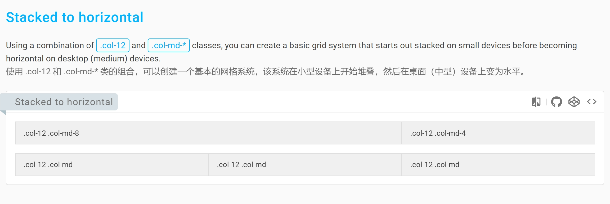
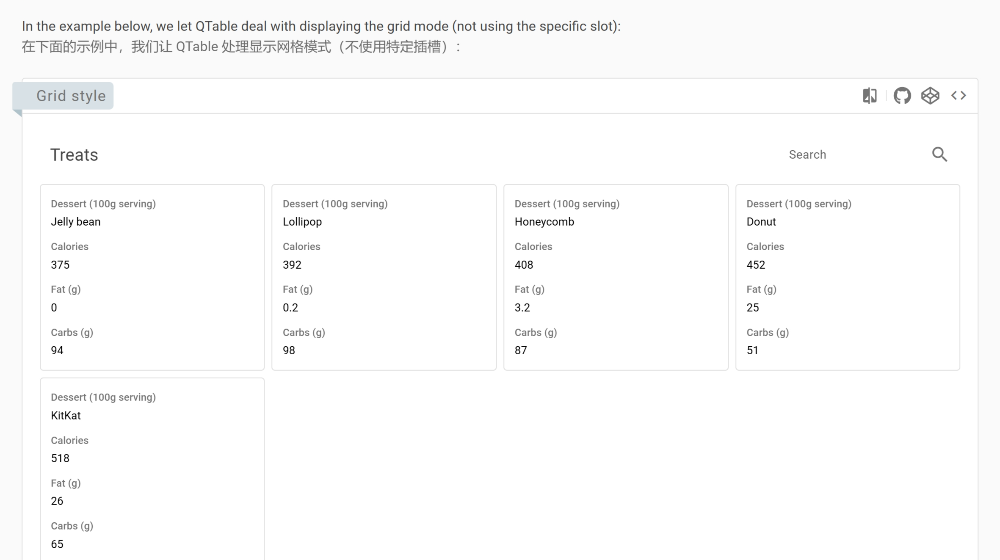

# 开发文档

## 目录结构说明

https://quasar.dev/quasar-cli-webpack/directory-structure

## 参考设计方案

## 启发
1. 在quasar的目录结构中，包含两块
- layouts: 为多个page页面提供共享布局
- pages ：隶属于某个布局的页面

在路由中根据 这种结构来组合页面

1. Quasar provides some out of the box Webpack aliases (‘layouts’ which points to ‘/src/layouts’ and ‘pages’ which points to ‘/src/pages’), which are used in the above examples.
- layouts 别名 定位为src/layouts
- pages 别名 定位为 src/layouts

2. QPageScroller must be the last child element within its parent, so it can display on top of other content

## flex 布局
1. flex布局可以应用到 容器元素和其子元素

### flex父元素 相关
1. flex父元素 必须 指定一下 类

### flex 子元素相关
Quasar uses a 12 point column system for distributing the size of row children. Here are some examples of the available CSS helper classes:
类星体使用 12 点列系统来分配行子行的大小。以下是一些可用的 CSS 帮助程序类示例：

1. 特殊的辅助类

2. 等宽列
3. 指定列宽
4. 根据列内容 自动调整 宽度 使用 col-{breakpoint}-auto 类，列可以根据其内容的自然宽度调整其大小。
5. 同时适配小屏和大屏，根据设备大小 动态调整，如果是小设备 自动进行列堆叠

